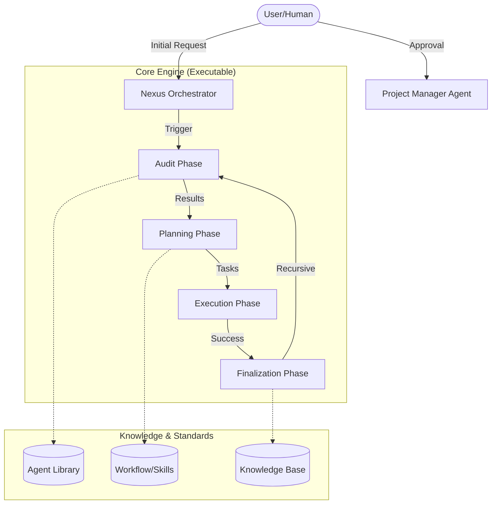

# 🤖 Human-AI Nexus:

A modular semantic multi-agent operating framework
with dynamic capability orchestration.

> **Version**: v1.1.1 (Phase 1: Knowledge Evolution)

[](documentation/nexus_rules/PANDUAN_CEPAT.md)

## 📌 Pendahuluan: Mengapa Human-AI Nexus?

Banyak developer terjebak dalam alur kerja AI yang kacau: AI langsung menulis kode tanpa rencana, menghasilkan bug yang sulit dilacak, atau mengabaikan aspek keamanan dan hukum.

**Human-AI Nexus** hadir untuk mengatasi masalah tersebut. Ini adalah pusat kendali dan dokumentasi terstruktur yang dirancang untuk menjembatani kolaborasi antara **Human Developer** dan **AI Assistant**. Framework ini memastikan setiap tahap pengembangan terdokumentasi dengan ketat melalui prinsip **"Documentation-First"** sebelum satu baris kode pun ditulis.

### 🎯 Target Pengguna

- **Web Developers**: Untuk menjaga kualitas kode dan keamanan arsitektur.
- **Project Managers**: Untuk memantau progres dan dokumentasi teknis secara otomatis.
- **AI Enthusiasts**: Untuk bereksperimen dengan orkestrasi agent AI yang kompleks.
- **Trainers/Mentors**: Sebagai standar pembelajaran pengembangan perangkat lunak yang disiplin.

---

## 🗺️ Daftar Isi

- [🤖 Apa itu Human-AI Nexus?](#-apa-itu-human-ai-nexus)
- [🏗️ Arsitektur Sistem](#️-arsitektur-sistem)
- [📂 Struktur Folder (Organized)](#-struktur-folder-organized)
- [🛠️ Cara Penggunaan](#️-cara-penggunaan)
- [🌟 Prinsip Utama](#-prinsip-utama)
- [🤝 Cara Berkontribusi](#-cara-berkontribusi)

---

Human-AI Nexus bukan sekadar kumpulan folder, melainkan sebuah **Autonomous Governance Engine**. Di dalamnya terdapat **Nexus Engine** yang secara otomatis mengoordinasikan berbagai Agent AI serta mengoperasikan **10+ Mesin Otonom** untuk melakukan audit, perencanaan, hingga eksekusi tugas secara fisik.

### ⚙️ 10+ Mesin Otonom (The Core Machines)

Sistem ini ditenagai oleh modul-modul spesialis yang bekerja secara independen:

1.  **Validator.js**: Verifikasi bukti fisik keberhasilan tugas.
2.  **BugHunter.js**: Penegak "Aturan 3 Perbaikan" untuk mencegah loop halusinasi.
3.  **Designer.js**: Automasi penalaran desain (Warna, Font, Style).
4.  **AssetEngine.js**: [NEW] Manajemen aset dan media otomatis.
5.  **AccessibilityScanner.js**: Pemindaian standar WCAG/A11y otomatis.
6.  **SchemaGuard.js**: Penegak standar database (UUID/Fillable).
7.  **QueryOptimizer.js**: Deteksi foreign key tanpa index.
8.  **RootCauseAnalyzer.js**: Analisis akar masalah otomatis dari stack trace.
9.  **TDDScaffolder.js**: Pembangun scaffold pengujian otomatis berbasis Iron Laws.
10. **TDDGuard.js**: [NEW] Proteksi integritas pengujian selama eksekusi.
11. **LaravelArchitect.js**: [Next Release] Spesialis otomasi Laravel.
12. **WorktreeManager.js**: [Next Release] Isolasi workspace otomatis.

Sistem ini juga dilengkapi dengan **Universal Collision Logic**, yang memungkinkan AI untuk menyimpan beberapa alternatif solusi (**Opsi A maupun Opsi B**) dalam satu dokumen, memungkinkan pengambilan keputusan (Decision Making) yang lebih cerdas dan kontekstual.

### Visi Utama

Menciptakan ekosistem pengembangan di mana AI bekerja sebagai **Tim Profesional** yang patuh pada standar kualitas manusia, bukan sekadar chatbot yang menulis kode asal-asalan.

---

## 🏗️ Arsitektur Sistem



---

## 📂 Struktur Folder (AI Agent System Structure)

| Folder                             | Deskripsi                                                             |
| :--------------------------------- | :-------------------------------------------------------------------- |
| `📂 agent/core/`                   | **Core Logic**: NexusEngine, Orchestrator, dan Smart Shelving Engine. |
| `📂 agent/tools/`                  | **Tools & Specialists**: Auditor, TDDGuard, Machinist, dan Distiller. |
| `📂 agent/prompts/`                | **The Brain**: Library Agent MD (Internal & External).                |
| `📂 workflow/`                     | **Skill Rack**: Aturan main (Workflows) berbasis kategori.            |
| `📂 memory/long_term/`             | **Smart HUB**: Knowledge yang sudah disusun dalam **Rak Semantik**.   |
| `📂 memory/long_term/security/`    | **Rack**: Keamanan, Auth, dan Protokol Audit.                         |
| `📂 memory/long_term/performance/` | **Rack**: Optimasi, Caching, dan Speed.                               |
| `📂 memory/long_term/ui-ux/`       | **Rack**: Design, Aesthetics, dan Responsive Standards.               |
| `📂 documentation/nexus_rules/`    | **Governance**: Instruksi operasional permanen untuk Manusia.         |
| `📂 tests/`                        | **TDD Lab**: Pengujian otomatis (15+ Project) berbasis Iron Laws.     |

---

## 🛠️ Cara Penggunaan

### 1. Instalasi

Gunakan perintah otomatis via `npx` (direkomendasikan):

```bash
# Jika sudah publish ke npm:
npx @faisal-trainer/human-ai-nexus

# Atau jalankan langsung dari GitHub (Jika belum publish):
npx github:Faisal-Trainer/Human-AI-Nexus
```

Atau copy seluruh folder framework ini secara manual ke dalam root proyek Anda.

> **Tip**: Untuk memperbarui framework yang sudah terinstall tanpa menghapusnya, gunakan flag `--force`:
> `npx github:Faisal-Trainer/Human-AI-Nexus --force`

### 3. Jalankan Engine

Jalankan perintah berikut di terminal:

```bash
# Via GitHub (Direkomendasikan jika belum publish):
npx github:Faisal-Trainer/Human-AI-Nexus nexus run

# Via NPM (Jika sudah publish):
npx @faisal-trainer/human-ai-nexus nexus run

# Lokal/Alias (Jika sudah terpasang):
nexus run           # Menjalankan siklus Audit -> Plan -> Execute
nexus audit         # Hanya melakukan pemindaian (Audit)
nexus harvest <dir> # Memanen dokumen dari proyek lain ke Golden HUB
nexus distill       # [Pipeline Utama] Shelving (Recursive) -> Hub Index -> Neural Map
nexus distill --rack <name> # Menjalankan distilasi hanya pada rak tertentu (e.g. security)
nexus refactor      # Sinkronisasi massal dari Golden ke HUB
nexus update-skills # Sinkronisasi massal dari HUB ke Agent Skills
```

### 4. Uninstall (Lepas Engine)

Jika ingin melepas Nexus Engine dari proyek Anda tanpa menghapus dokumentasi:

```bash
npx github:Faisal-Trainer/Human-AI-Nexus dell
```

_Perintah ini menghapus folder `agent/` (otak AI), namun tetap menjaga folder `documentation/` agar tetap bisa diakses oleh tim pengembang._

### 3. Ikuti Alur Kerja

1. **Audit**: Biarkan AI memeriksa kesehatan proyek Anda.
2. **Plan**: Setujui rencana yang dibuat oleh Project Manager di folder `documentation/planning/`.
3. **Execute**: Biarkan AI mengeksekusi tugas sesuai rencana.
4. **Finalize**: Simpan hasil ke dalam `memory/short_term/` untuk memori jangka panjang.

---

## 🌟 Prinsip Utama

- **Deep Wisdom Injection**: Setiap Agent membawa "Buku Saku" workflow mereka sendiri di dalam sistem prompt.
- **Knowledge Portability**: Skill dan pengetahuan institusional ikut terinstal ke proyek eksternal via folder `workflow/`.
- **Deterministic Contracts**: Standar interface data untuk menjamin AI bekerja secara konsisten.
- **Standardized Knowledge**: Seluruh HUB menggunakan pola `NEXUS_...` untuk kemudahan pengindeksan.

---

## 🤝 Cara Berkontribusi

Kami menyambut kontribusi dari siapa saja!

1. **Fork** repository ini.
2. Buat **Branch** baru untuk fitur Anda (`git checkout -b feature/FiturKeren`).
3. **Commit** perubahan Anda (`git commit -m 'Menambahkan fitur keren'`).
4. **Push** ke branch tersebut (`git push origin feature/FiturKeren`).
5. Buat **Pull Request**.

---

_Dikelola oleh Faisal-Trainer & AI Assistant. Mari bangun masa depan kolaborasi Human-AI yang lebih disiplin!_

---

_Terakhir Dioptimasi: 10/05/2026 (Phase 1 - Knowledge Evolution)_
