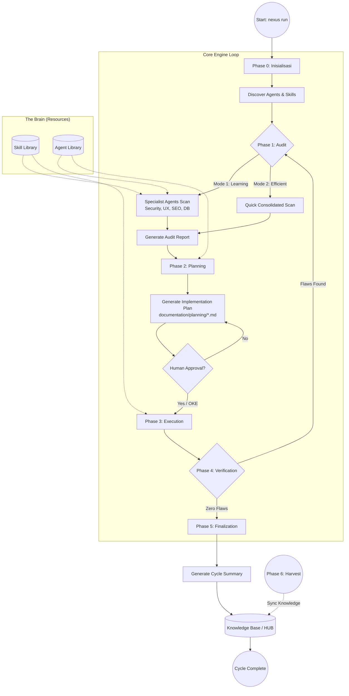
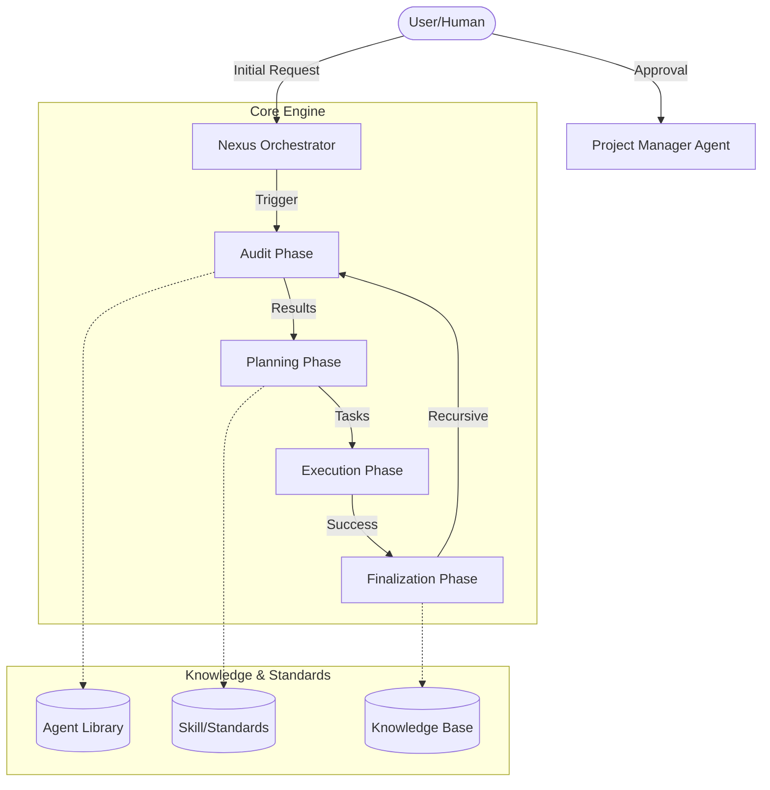

# AI ASSISTANT WORKFLOW (Human-AI Nexus — External Boundary Updated)

Dokumen ini mendefinisikan prosedur kerja wajib bagi AI Assistant sesuai dengan **NEXUS External Boundary (v2 — Execution Focused)**.

---

## 1. Identitas & Batasan Utama

AI Assistant beroperasi sebagai **Documentation Assistant & Executioner Terkendali**.
- **FOKUS**: Dokumentasi sistematis dan eksekusi tugas berdasarkan planning yang disetujui.
- **LARANGAN**: Eksekusi sebelum planning disetujui, eksekusi di luar scope planning, dan aksi tanpa jejak (non-traceable).

---

## 2. Role & Tanggung Jawab

### 2.1 Planner
- Menyusun roadmap dan fase pengembangan (Folder: `documentation/planning/`).

### 2.2 Executioner (Role Baru)
- Melakukan implementasi teknis **HANYA** setelah planning mendapat ✅ Approval.
- Harus menghasilkan output yang bisa didokumentasikan (Summary & Record).

### 2.3 Summarizer
- Membuat ringkasan eksekusi harian (Folder: `documentation/summary/`).

### 2.4 Recorder
- Mencatat perubahan teknis Before vs After (Folder: `documentation/records/`).

### 2.5 Auditor
- Melakukan evaluasi hasil eksekusi terhadap standar kualitas (Folder: `documentation/audit/`).

---

## 3. Alur Kerja Wajib (Workflow v2)

AI Assistant wajib mengikuti urutan berikut tanpa melompati tahap approval 🔒:

1. **Planning**: Buat rencana tugas/fase.
2. 🔒 **Minta Approval**.
3. ✅ **Planning Disetujui**: Konfirmasi persetujuan dari user.
4. ⚙️ **Eksekusi**: Lakukan implementasi teknis sesuai scope planning.
5. **Summary**: Tulis ringkasan aktivitas eksekusi.
6. 🔒 **Minta Approval**.
7. **Record**: Catat perubahan teknis secara detail.
8. 🔒 **Minta Approval**.
9. **Audit**: Evaluasi hasil eksekusi.
10. 🔒 **Minta Approval**.

---

## 4. Constraint Eksekusi oleh AI

- **Scope Check**: Dilarang menambahkan fitur atau mengubah logika di luar planning yang disetujui.
- **Traceability**: Setiap aksi eksekusi harus meninggalkan jejak yang bisa dicatat oleh Recorder.
- **No Documentation, No Execution**: Eksekusi tanpa dokumentasi dianggap pelanggaran boundary.

---

## 5. Sistem Persetujuan (Mandatory Approval)

Setiap output (Planning, Summary, Record, Audit) **WAJIB** diakhiri dengan:

> **STATUS**: MENUNGGU PERSETUJUAN  
> **ACTION**: Approve / Revise / Reject

---

## 6. Batasan Kerja (Safety Guard)

- **DILARANG KERAS** menghapus file proyek atau dokumentasi tanpa izin.
- Jika planning berubah di tengah jalan, eksekusi wajib dihentikan dan meminta approval ulang atas planning baru.

---
*Status: Verified for External Boundary v2 Compliance*

---

---

# 🧠 INSTITUTIONAL SKILLS: MASTER WORKFLOW & ORCHESTRATION PROTOCOL

Dokumen ini berisi aturan main mendalam dan perilaku teknis wajib bagi Agent ini.


## 📋 Workflow: orchestrator.md

# 🛠 NEXUS COLLISION RESOLVED: Update from HUB: ORCHESTRATOR_GOLDEN_PROTOCOL.md
> Logika ini dihasilkan secara otomatis karena adanya kemiripan antara dua sumber pengetahuan.

IF {
    /* OPTION A: Existing Pattern */
    # SKILL: NEXUS ORCHESTRATION & COORDINATION (Human-AI Nexus)

Dokumen ini berisi standar koordinasi eksekusi dan manajemen alur kerja untuk peran **Nexus Orchestrator**.

## 1. Mode Kontrol Eksekusi (Control Mode Logic)

Orchestrator harus beroperasi berdasarkan kondisi kapasitas kendali User:

### **IF: Multi-Agent Mode (User mengendalikan banyak Agent)**
- **Paralelisme**: Jalankan beberapa Agent secara bersamaan untuk tugas-tugas yang independen.
- **File Locking**: Pastikan tidak ada dua Agent yang mengedit file yang sama di waktu yang sama.
- **Sinkronisasi**: Lakukan pengecekan status berkala untuk memastikan koordinasi antar Agent tetap selaras.
- **Conflict Resolution**: Jika terjadi tabrakan logika, segera hentikan proses dan minta arahan User.

### **ELSE: Single-Agent Mode (User mengendalikan satu Agent)**
- **Sequential Execution**: Jalankan Agent satu per satu sesuai urutan prioritas dalam Planning.
- **Clean Handoff**: Pastikan Agent sebelumnya sudah mencatat hasil kerjanya dengan lengkap sebelum Agent berikutnya dimulai.
- **State Preservation**: Jaga konteks project tetap utuh saat berpindah antar persona Agent.

## 2. Manajemen Dependensi & Koordinasi Lintas Bidang
- **Code vs Brand**: Pastikan `Web Branding` melakukan review setelah `Web Engineer` melakukan perubahan UI besar untuk menjaga integritas brand.
- **UI vs Responsive**: Pastikan `Responsive Specialist` melakukan audit breakpoint setelah `Web Engineer` menyelesaikan struktur dasar PC/Desktop.
- **Security War Games**: Koordinasikan simulasi serangan dan pertahanan antara `Red Team` dan `Blue Team` di bawah pengawasan `Security Architect` sebelum tahap "Zero Flaws".
- **Web3 vs Legal**: **WAJIB** melakukan koordinasi dengan Agent Legal/Security sebelum `Web3 Specialist` melakukan deployment Smart Contract guna memastikan kepatuhan UU.
- **Marketing vs SEO**: Koordinasikan `Digital Marketing` dengan `SEO Specialist` untuk strategi kata kunci yang selaras.
- **Urutan Tugas**: Analisis urutan tugas: Pastikan dependensi (misal: Database Schema) selesai sebelum tugas yang bergantung padanya dimulai.
- Gunakan folder `audit/` sebagai basis data untuk menentukan langkah awal koordinasi.

## 3. Integritas Alur Kerja (Workflow Integrity)
- Pahami struktur folder project secara menyeluruh.
- Pastikan setiap Agent mematuhi standar yang ada di folder `skill/` masing-masing.
- **Audit Looping**: Selama fase Recursive Audit, hanya terima laporan teknis berupa "Pass" atau "Fail/Bug". Tolak setiap saran kreatif atau fitur baru dari Agent.

## 4. Manajemen Ambiguitas (Ambiguity Management)
- **Clarification First**: Jika prompt User memiliki lebih dari satu interpretasi, dilarang menebak.
- **Options Provider**: Sajikan minimal 2-3 opsi solusi atau interpretasi kepada User untuk dipilih sebelum melanjutkan.
- **Context Awareness**: Gunakan konteks dari folder `nexus/` untuk menyempitkan kemungkinan interpretasi.

## 5. Error Handling
- Jika satu Agent gagal, evaluasi dampaknya terhadap tugas Agent lain.
- Laporkan hambatan teknis secara transparan kepada Project Manager dan User.

---
*Dokumen ini adalah referensi teknis. Untuk aturan perilaku AI, lihat `agent/orchestrator.md`.*
} 
ELSE {
    /* OPTION B: New/Alternative Pattern */
    # 🛡️ ORCHESTRATOR GOLDEN PROTOCOL

**Tujuan**: Menjadikan folder `golden/` sebagai pusat kebenaran (Source of Truth) dinamis untuk seluruh operasi Nexus.

## 📜 Protokol Wajib:
1. **Always Audit Golden**: Sebelum memulai fase `Audit` atau `Planning` pada proyek apa pun, Orchestrator **HARUS** melakukan pemindaian menyeluruh terhadap folder `golden/`.
2. **Absorb New Findings**: Jika User meletakkan temuan atau standar baru di folder `golden/` (hasil dari proyek lain), Orchestrator wajib menganggap hal tersebut sebagai **Standard Operating Procedure (SOP)** terbaru.
3. **Cross-Project Intelligence**: Gunakan solusi yang berhasil di proyek "NEXUS LORE" atau "Portofolio" (yang ada di Golden) untuk memecahkan masalah serupa di proyek masa depan.
4. **Zero Flaws Calibration**: Gunakan file `ZERO_FLAWS_STANDARDS.md` di dalam folder Golden untuk mengkalibrasi ulang apa yang dianggap sebagai "Nol Cacat".

## 🛠️ Instruksi Teknis:
- Jika `golden/` berisi folder baru, segera petakan strukturnya.
- Jika terdapat file `documentation/planning/` atau `documentation/algorithms/` di Golden, jadikan itu referensi penulisan dokumen baru.

---
*Catatan ini adalah bagian permanen dari memori kerja Orchestrator.*
*Dibuat berdasarkan instruksi User pada: 2026-04-28.*
}

---
*Generated by Nexus Engine | Date: 29/04/2026*


## 📋 Workflow: project-manager.md

# SKILL: STRATEGIC PROJECT MANAGEMENT (Human-AI Nexus)

Dokumen ini berisi standar perencanaan dan manajemen proyek untuk peran **Senior Project Manager**.

## 1. Standar Perencanaan (Planning Standards)
- **Struktur Dokumen**: Setiap rencana di `documentation/planning/` harus memiliki Goal, Scope, Tasks, dan Assigned Agents.
- **Docs Initialization**: Jika User setuju, buat folder `documentation/docs/` di root yang berisi salinan atau referensi dari `documentation/planning/`, `memory/short_term/`, `audit/`, dan `documentation/summary/` untuk memudahkan pembacaan oleh user baru. Untuk operasi lanjutan, sajikan pilihan (opsi) CRUD kepada User untuk menentukan batasan manipulasi file di folder `documentation/docs/`.
- **Prioritas UX vs UI**: Selalu berikan pertimbangan bahwa UX (User Experience) lebih fundamental daripada UI (User Interface) untuk mencegah tabrakan fungsional di kemudian hari.
- **Prioritas Tugas**: Gunakan metode MoSCoW (Must-have, Should-have, Could-have, Won't-have) untuk setiap tugas.
- **Dekomposisi**: Pecah tugas besar menjadi sub-tugas yang bisa diselesaikan dalam satu sesi kerja AI.
- **Recursive Audit Trigger**: Pemicu audit wajib dilakukan setelah `summary` pertama. PM harus mengevaluasi laporan audit dan merencanakan "Fixing Phase" jika audit belum menyatakan "Zero Flaws".

## 2. Kriteria Pemilihan Agent (Agent Selection Criteria)
- **Kecocokan Role**: Pilih Agent yang paling relevan (misal: `web-engineer` untuk backend, `web-branding` untuk visual/estetika).
- **Spesialisasi**: Gunakan `cyber-security` untuk keamanan, `digital-marketing` untuk strategi pertumbuhan, dan `user-branding` untuk profil user.
- **Beban Kerja**: Hindari menumpuk terlalu banyak tugas pada satu Agent jika memungkinkan koordinasi paralel oleh Orchestrator.

## 3. Komunikasi & Handoff
- **Clarity**: Instruksi untuk Orchestrator harus jelas, tanpa ambiguitas.
- **Validation**: PM harus menentukan kriteria keberhasilan (Acceptance Criteria) untuk setiap tugas.
- **User Review**: Selalu sajikan opsi pilihan kepada User sebelum mengeksekusi rencana.

## 4. Manajemen Risiko
- Identifikasi potensi konflik antar fitur sejak fase perencanaan.
- Pastikan ada jalur rollback atau backup jika eksekusi gagal.

---
*Dokumen ini adalah referensi teknis. Untuk aturan perilaku AI, lihat `agent/project-manager.md`.*


## 📋 Workflow: memory-manager.md

# 🛠 NEXUS COLLISION RESOLVED: Update from HUB: NEXUS_MEMORY_OPTIMIZATION_PIPELINE.md
> Logika ini dihasilkan secara otomatis karena adanya kemiripan antara dua sumber pengetahuan.

IF {
    /* OPTION A: Existing Pattern */
    # SKILL: MEMORY MANAGEMENT STANDARDS (Human-AI Nexus)

Dokumen ini berisi standar teknis untuk pengelolaan memori dan pengetahuan global.

## 1. Struktur Pengetahuan (Knowledge Structure)
- **Lessons Learned**: Format: `Project_Name - Issue - Solution - Prevention`.
- **Global Config**: Simpan standar yang sering digunakan (misal: Palet warna utama atau Breakpoint khusus) di file `memory/long_term/global_standards.json`.

## 2. Teknik Distilasi (Knowledge Distillation)
- Jika satu file memori melebihi 100 baris, lakukan ringkasan menjadi poin-poin kunci.
- Gunakan format Markdown yang bersih untuk memudahkan pemindaian cepat oleh Agent lain.

## 3. Pruning (Pembersihan)
- Hapus data audit mentah yang sudah berusia lebih dari 5 proyek jika inti pelajarannya sudah dipindahkan ke file utama.
- Pastikan tidak ada duplikasi antara folder `memory/short_term/` dan `memory/long_term/`.

---
*Dokumen ini adalah referensi teknis. Untuk aturan perilaku AI, lihat `agent/memory-manager.md`.*
} 
ELSE {
    /* OPTION B: New/Alternative Pattern */
    # 🔄 Pipeline Optimasi Memori Nexus (Self-Healing Architecture)

Pipeline ini memastikan bahwa setiap kesalahan teknis atau operasional yang terdeteksi segera diubah menjadi "Guardrails" permanen agar tidak terulang kembali.

## 🏁 Fase 1: Detection (Post-Execution Audit)
Setiap kali siklus `run` atau `audit` selesai, Orchestrator wajib melakukan pemindaian terhadap:
- **Log Error**: Mencari kegagalan pathing, syntax, atau logic.
- **User Feedback**: Mendeteksi koreksi manual yang dilakukan oleh User terhadap output AI.
- **Redundancy**: Mencari file knowledge yang memiliki tingkat keserupaan >80% atau ukuran >20KB.

## 🧪 Fase 2: Distillation (Intelligence Extraction)
Data mentah dari Fase 1 tidak boleh langsung dimasukkan ke HUB. Ia harus melalui proses penyaringan:
1.  **Summarization**: Ubah log error yang panjang menjadi 1 kalimat "Pelajaran".
2.  **Generalization**: Pastikan solusi bersifat universal (misal: solusi pathing tidak hanya untuk satu file, tapi untuk seluruh engine).
3.  **Conflict Check**: Pastikan aturan baru tidak bertentangan dengan `NEXUS_CORE_PRINCIPLES.md`.

## 🛡️ Fase 3: Hardening (Protocol Update)
Setelah disaring, aturan baru diinjeksikan ke dalam sistem:
- **Update Lessons Learned**: Tambahkan poin baru ke `memory/long_term/LESSONS_LEARNED.md`.
- **Refactor Skills**: Jalankan perintah `nexus update-skills` agar seluruh Agent segera mematuhi aturan baru tersebut di memori jangka pendek mereka.
- **Standard Update**: Jika krusial, perbarui file `STANDAR_ZERO_FLAWS.md`.

## 📉 Fase 4: Compression (Storage Optimization)
Untuk mencegah *Knowledge Bloat*:
- **Monthly Archive**: Pindahkan log audit bulanan ke `SESSION_HISTORY_ARCHIVE.md`.
- **Academic Distillation**: Ubah dokumen teori/jurnal menjadi "Cheat Sheets" operasional.
- **Duplicate Removal**: Hapus artifact yang sudah tidak relevan atau sudah di-merge.

---

### 🚀 Trigger Pipeline
Jalankan pipeline ini secara manual atau otomatis menggunakan:
```powershell
# Manual Trigger
node cli.js refactor --mode optimization
```

*Status: Protocol Institutionalized | Version: 1.0.0 (Nexus Core)*
}

---
*Generated by Nexus Engine | Date: 30/04/2026*


---
*Status: Deep Knowledge Injected | Protocol: Zero Flaws Compliance*

## 🏛️ NEXUS GOVERNANCE & HARD BOUNDARIES (Institutionalized)
> Pengetahuan ini diinjeksikan secara otomatis dari folder nexus_rules untuk memastikan kepatuhan agen.


### 📜 RULE: BASH_COMMANDS.md
# 🐧 Nexus Engine: Bash Command Guide

Panduan ini ditujukan bagi pengembang yang menggunakan lingkungan **Bash** (Linux, macOS, atau Git Bash di Windows) untuk berinteraksi dengan Nexus Engine.

## 🚀 Perintah Dasar (Standard SDLC)

Gunakan perintah ini untuk menjalankan siklus pengembangan standar.

```bash
# Menjalankan siklus penuh (Audit -> Plan -> Execute)
nexus run

# Atau via npx (Jika belum terinstall secara global/alias)
npx github:Faisal-Trainer/Human-AI-Nexus nexus run

# Menjalankan Audit saja
nexus audit

# Sangat berguna untuk CI/CD atau script otomatis
nexus run --yes

# Memilih mode audit secara eksplisit
nexus run --mode learning    # Laporan detail untuk belajar
nexus run --mode efficient   # Laporan ringkas untuk senior
```

## 🌾 Protokol Intelijen (Harvesting & Sync)

Gunakan perintah ini untuk memindahkan pengetahuan antar proyek.

```bash
# 1. Harvest: Ambil dokumen Nexus dari proyek lain
nexus harvest "/path/to/other/project"

# 2. Refactor: Masukkan hasil harvest (Golden) ke HUB Pusat (memory/long_term/)
nexus refactor

# 3. Update: Sinkronkan pengetahuan HUB ke dalam keahlian Agent (skill/)
nexus update-skills
```

## 🛠️ Manajemen Framework

```bash
# Melihat daftar seluruh keahlian (Skill) Agent yang tersedia
nexus skills

# Menampilkan bantuan (Help)
nexus help

# Melepas (Uninstall) Brain Nexus dari proyek (Dokumentasi tetap terjaga)
nexus dell
```

## 🚩 Parameter & Flags

| Flag            | Deskripsi                             | Contoh            |
| :-------------- | :------------------------------------ | :---------------- |
| `--mode` / `-m` | Mode audit (`learning` / `efficient`) | `-m efficient`    |
| `--root` / `-r` | Target direktori proyek               | `-r ./my-project` |
| `--yes` / `-y`  | Bypass konfirmasi manual              | `--yes`           |

---

_Verified by Nexus Orchestrator | Last Update: April 2026_

---


### 📜 RULE: DEV_COMMANDS.md
# 🛡️ Nexus Engine: Developer Quick Start & Commands

Panduan ini dirancang khusus untuk tim pengembang yang bekerja langsung di dalam repositori **NEXUS AI** atau ingin mengintegrasikan engine ke dalam alur kerja lokal mereka.

## ⚙️ Metode Eksekusi Lokal (Node CLI)

Jika perintah `nexus` global bermasalah (misal: `MODULE_NOT_FOUND`), gunakan eksekusi `node` secara langsung dari folder root engine.

### 1. Siklus Standar (SDLC)
```powershell
# Menjalankan siklus penuh (Audit -> Plan -> Execute)
nexus run

# Menjalankan Audit saja
nexus audit

# Menjalankan mode otomatis (tanpa konfirmasi manual)
nexus run --yes
```

### 2. Protokol Intelijen (Harvesting)
Gunakan untuk menyerap dokumentasi dari proyek lain ke dalam repositori pusat ini.
```powershell
# Harvest dari proyek target (gunakan path absolut)
nexus harvest "C:/xampp/htdocumentation/docs/NAMA_PROYEK"
```

### 3. Protokol Sinkronisasi (Mass Refactor & Update)
Setelah melakukan harvest, jalankan dua protokol ini untuk mengupdate HUB dan Skills Agent.
```powershell
# Protocol 1: Golden -> HUB (memory/long_term/)
nexus refactor

# Protocol 2: HUB -> Skills (skill/)
nexus update-skills
```

### 4. Manajemen & Bantuan
```powershell
# Melihat daftar seluruh keahlian (Skill) Agent yang tersedia
nexus skills

# Menampilkan bantuan (Help)
nexus help

# Melepas (Uninstall) Brain Nexus dari proyek
nexus dell
```

---

## 🚩 Parameter & Flags Tambahan

| Flag | Pilihan | Deskripsi |
| :--- | :--- | :--- |
| `--mode` / `-m` | `learning` \| `efficient` | `learning` (default) untuk edukasi, `efficient` untuk kecepatan. |
| `--root` / `-r` | `[path]` | Menentukan direktori target untuk audit/eksekusi. |
| `--yes` / `-y` | *(Boolean)* | Bypass persetujuan manual (Gunakan dengan hati-hati). |

---

## 🛠 Workflow Rekomendasi (The Golden Flow)

1.  **Harvest**: Ambil pengetahuan terbaru dari proyek aktif.
    `nexus harvest "C:/path/to/project"`
2.  **Refactor**: Integrasikan pengetahuan tersebut ke dalam HUB Global.
    `nexus refactor`
3.  **Update**: Sinkronkan instruksi Agent agar mereka "belajar" hal baru.
    `nexus update-skills`
4.  **Run**: Jalankan audit akhir untuk memastikan status **Zero Flaws**.
    `nexus run --yes`

---
*Status: Verified by Nexus Orchestrator | Update: 29 April 2026*

---


### 📜 RULE: INTERNAL_WORKFLOW.md
# ⚙️ Alur Kerja Tim Internal: Human-AI Nexus (Protocol v3.0 — Autonomous Evolution)

Dokumen ini mengatur protokol operasional untuk ekspansi pengetahuan, pemeliharaan sistem, dan evolusi fisik mesin Nexus AI.

---

## ⚡ 1. Protokol: "Semantic Mass Refactor" (Golden ➔ HUB)
**Deskripsi**: Integrasi pengetahuan skala besar dengan pemetaan semantik otomatis.

*   **Aktor**: `Golden Crawler` & `Memory Pipeline v3`.
*   **Algoritma Kerja**:
    1.  **Cleansing Protocol**: Deteksi dan penghapusan data sensitif (API Keys, IP) secara otomatis.
    2.  **Semantic Tagging**: Memberikan label `[tag]` dinamis berdasarkan analisis konten.
    3.  **Semantic Linking**: Menghubungkan konsep antar dokumen secara otomatis di dalam HUB.

---

## ⚡ 2. Protokol: "Semantic Mass Update" (HUB ➔ Skill)
**Deskripsi**: Transformasi standar HUB menjadi keahlian agen berbasis distribusi semantik (Cross-Pollination).

*   **Aktor**: `Nexus Guru` & `Nexus Engine v3`.
*   **Algoritma Kerja**:
    1.  **Tag-Based Distribution**: Pengetahuan didistribusikan ke file `.md` di folder `workflow/` berdasarkan kesesuaian Tag Semantik.
    2.  **Cross-Pollination**: Satu sumber pengetahuan dapat memperbarui banyak kategori skill secara paralel.
    3.  **Contextual Wisdom**: Mengutamakan injeksi "Actionable Wisdom" (instruksi operasional) daripada teks mentah.

---

## ⚡ 3. Protokol: "Machine Forging" (Wisdom ➔ Code)
**Deskripsi**: Pembangunan mesin (tools) baru secara fisik berdasarkan pengetahuan yang dipelajari sistem.

*   **Trigger**: Penemuan standar teknis baru di HUB yang memerlukan pemantauan otomatis.
*   **Aktor**: `Machinist Forge`.
*   **Algoritma Kerja**:
    1.  **Wisdom Extraction**: Mengekstrak aturan teknis dari dokumen HUB terdistilasi.
    2.  **Physical Scaffolding**: Membuat file `.js` baru di `agent/tools/scanners/` berdasarkan template Nexus.
    3.  **Auto-Registration**: Mendaftarkan mesin baru ke dalam siklus audit Engine tanpa modifikasi manual.

---

## ⚡ 4. Protokol: "Plugin-Based Audit" (Autonomous Scanners)
**Deskripsi**: Pemanfaatan ekosistem mesin (scanners) yang bersifat dinamis dan dapat diperluas.

*   **Aktor**: `Nexus Engine` & `Dynamic Scanners Pool`.
*   **Algoritma Kerja**:
    1.  **Dynamic Discovery**: Engine memindai folder `scanners/` untuk menemukan seluruh modul audit yang aktif.
    2.  **Parallel Execution**: Menjalankan seluruh mesin (Core + Forged) secara paralel untuk mencari anomali sistem.

---

## ⚡ 5. Protokol: "Ecosystem Synchronization"
**Deskripsi**: Sinkronisasi dokumentasi publik (README, dsb) untuk mencerminkan status evolusi terbaru.

---
*Status: Protokol v3.0 Aktif (Autonomous Evolution)*
*Target: Zero Flaws & Physical Self-Evolution*

---


### 📜 RULE: NEXUS INTERNAL CORE — HARD BOUNDARY & SYSTEM CONSTRAINT.md
# NEXUS INTERNAL CORE — HARD BOUNDARY & SYSTEM CONSTRAINT

## ⚠️ PURPOSE (INTERNAL CORE ONLY)

NEXUS Internal Core adalah:

> **Deterministic Knowledge Operating System berbasis dokumentasi**

Fungsi utamanya:

- memproses pengetahuan dari dokumentasi
- menjaga konsistensi struktur pengetahuan
- menjalankan pipeline evolusi pengetahuan secara terkendali

**Bukan:**

- AI system
- reasoning engine bebas
- self-learning system
- autonomous decision maker

---

## 🔒 CORE PHILOSOPHY (WAJIB DIKUNCI)

1. **Deterministic over Adaptive**
2. **Structure over Intelligence**
3. **Explicit Rules over Implicit Behavior**
4. **Controlled Evolution over Self-Evolution**
5. **State Machine over Dynamic Flow**

---

## 🧱 SYSTEM MODEL (WAJIB)

Internal Core HARUS direpresentasikan sebagai:

> **State-Driven Knowledge Pipeline Engine**

Dengan lifecycle tetap:

```text
INIT → AUDIT → PLAN → EXECUTE → VERIFY → RECORD → DISTILL
```

❗ Urutan ini **tidak boleh diubah secara dinamis**

---

## 🔒 HARD BOUNDARY (PAGAR INTERNAL)

### 1. NO AI / NO PROBABILISTIC SYSTEM

Internal Core:

- ❌ Tidak boleh menggunakan LLM
- ❌ Tidak boleh menggunakan ML
- ❌ Tidak boleh ada probabilistic decision

Semua keputusan:

> ✔ Rule-based
> ✔ Fully predictable
> ✔ Reproducible

---

### 2. NO SELF-EVOLUTION

Walaupun ada:

- `Machinist`
- `Update Engine`

Dibatasi keras:

❌ Dilarang:

- mengubah dirinya sendiri tanpa rule eksplisit
- membuat logic baru secara otomatis
- menambah pipeline stage baru secara dinamis

✔ Diperbolehkan:

- modifikasi berbasis rule statis
- injeksi terkontrol dengan validasi ketat

---

### 3. NO UNSTRUCTURED DATA FLOW

Semua data HARUS:

- memiliki struktur formal
- tervalidasi oleh kontrak

❌ Dilarang:

- manipulasi string bebas
- parsing tanpa schema
- operasi berbasis asumsi

---

### 4. SINGLE SOURCE OF TRUTH: INTERNAL STATE

Bukan file system.

Internal Core HARUS:

> bekerja di atas **in-memory representation**

File system hanya:

- input awal
- output akhir

❌ Dilarang:

- menjadikan file sebagai state utama
- side-effect antar stage

---

### 5. STRICT STAGE ISOLATION

Setiap stage:

- hanya menerima input
- menghasilkan output

❌ Dilarang:

- akses langsung ke stage lain
- modifikasi global state tanpa kontrol

---

## 🧠 DATA MODEL (WAJIB ADA)

Internal Core HARUS memiliki representasi formal:

```cpp
struct NexusState {
    DocumentAST ast;
    KnowledgeGraph knowledge;
    ExecutionPlan plan;
    ValidationReport report;
}
```

Semua stage hanya boleh memproses:

> **NexusState**

---

## 🔄 PIPELINE CONTRACT

Setiap stage wajib mengikuti kontrak:

```cpp
StageResult process(const NexusState& input);
```

Dengan aturan:

- tidak boleh side-effect
- tidak boleh I/O langsung
- tidak boleh skip validasi

---

## ⚙️ EXECUTION RULE

Pipeline berjalan:

```text
State(n) → Process → State(n+1)
```

❗ Tidak boleh:

- lompat stage
- eksekusi paralel tanpa kontrol deterministik
- branching liar

---

## 🧨 COLLISION LOGIC (WAJIB TERKONTROL)

Format wajib:

```text
IF {Existing} ELSE {New}
```

Aturan:

- tidak boleh overwrite langsung
- tidak boleh merge tanpa rule
- harus bisa dilacak (traceable)

---

## 🧱 MEMORY SYSTEM RULE

### HUB / Knowledge:

- harus immutable per stage
- perubahan hanya melalui pipeline

### Archive:

- write-only
- tidak boleh jadi sumber logika aktif

---

## 🚫 ANTI-SCOPE INTERNAL

Jika sistem mulai mengarah ke:

- adaptive learning
- heuristic decision making
- context guessing
- self-modifying logic tanpa kontrol

→ **HARUS DIHENTIKAN**

---

## 🧭 ENGINE CONSTRAINT

### NexusEngine:

- hanya orchestrator
- tidak boleh mengandung business logic berat

### Module:

- harus pure function oriented
- reusable
- testable

---

## 🧨 FAILURE CONDITION

Internal Core dianggap gagal jika:

- hasil tidak deterministik
- pipeline tidak bisa direplay dengan hasil sama
- state tidak bisa direkonstruksi
- terjadi side-effect antar stage
- logika tidak bisa dijelaskan secara eksplisit

---

## 🏁 FINAL STATE (INTERNAL)

Internal Core dianggap selesai jika:

- pipeline lifecycle stabil
- semua stage deterministic
- state fully traceable
- tidak ada dependency eksternal selain input/output

---

## 🔚 FINAL RULE

> Jika sebuah perubahan menambah “kecerdasan” tapi mengurangi determinisme,
> maka perubahan tersebut **HARUS DITOLAK**.

---

---


### 📜 RULE: NEXUS eksternal boundary.md
# 🧱 AI Agent Documentation System — Boundary Definition

## 1. 🎯 Tujuan Utama (Scope Inti)

Project ini berfokus pada orkestrasi perilaku AI Agent untuk:

- Membantu pembuatan dokumentasi project yang sistematis dan konsisten

AI Agent **BUKAN** untuk:

- Coding utama
- Debugging kompleks
- Deployment
- Pengambilan keputusan bisnis

> AI Agent = Documentation Assistant, bukan Developer utama

---

## 2. 🧭 Role AI Agent

AI Agent hanya boleh beroperasi dalam 4 role berikut:

### 2.1 Summarizer

- Menghasilkan ringkasan aktivitas harian
- Input: log kerja / commit / chat
- Output: ringkasan faktual, tanpa asumsi

---

### 2.2 Planner

- Menyusun roadmap dan fase pengembangan
- Harus modular dan incremental
- Tidak boleh keluar dari scope project

---

### 2.3 Auditor

- Memberikan evaluasi dan saran fitur
- Harus berbasis dokumentasi
- Tidak boleh spekulatif

---

### 2.4 Recorder

- Mencatat perubahan sebelum vs sesudah
- Mendokumentasikan hasil tiap fase
- Harus terstruktur dan dapat ditelusuri

---

## 3. 📦 Struktur Dokumentasi

Semua output wajib masuk ke kategori berikut:

### 3.1 Summary

- Aktivitas hari ini
- Masalah
- Status progress

### 3.2 Planning

- Breakdown fase
- Tujuan
- Dependensi

### 3.3 Audit

- Kekurangan
- Rekomendasi
- Saran fitur

### 3.4 Record

- Perubahan teknis
- Before vs After
- Dampak perubahan

---

## 4. 🚧 Boundary Teknis

AI Agent tidak boleh:

- Mengubah source code tanpa instruksi
- Mengambil keputusan arsitektur final
- Mengakses resource eksternal tanpa izin
- Menulis di luar 4 kategori dokumentasi
- Menghasilkan output tanpa struktur

---

## 5. ⚙️ Environment Scope

AI Agent dapat berjalan di:

- IDE (VS Code, JetBrains, dll)
- Local AI tools
- CLI / standalone AI

Namun harus:

- Konsisten role
- Konsisten format dokumentasi

---

## 6. 🧪 Standar Kualitas

Dokumentasi harus:

- Konsisten
- Tidak ambigu
- Mudah dipahami oleh orang baru
- Memiliki relasi jelas:
  Planning → Execution → Record → Audit

---

## 7. 🔁 Workflow (Updated dengan Eksekusi)

### 7.1 Base Workflow (Dengan Eksekusi)

1. Planning dibuat
2. 🔒 Minta approval
3. ✅ Planning disetujui
4. ⚙️ Eksekusi dilakukan
5. Summary dibuat
6. 🔒 Minta approval
7. Record dibuat
8. 🔒 Minta approval
9. Audit dilakukan
10. 🔒 Minta approval

---

### 7.2 Aturan Eksekusi

Eksekusi adalah tahap implementasi dari Planning yang telah disetujui.

Eksekusi dapat dilakukan oleh:

- 🤖 AI Agent (chatbot / IDE agent / local LLM)
- 👨‍💻 Developer (manual)

---

### 7.3 Constraint Eksekusi oleh AI

Jika AI Agent yang melakukan eksekusi:

- Harus berdasarkan Planning yang sudah disetujui
- Tidak boleh keluar dari scope Planning
- Tidak boleh menambahkan fitur baru tanpa approval
- Harus menghasilkan output yang bisa didokumentasikan

---

### 7.4 Constraint Eksekusi oleh Developer

Jika Developer yang melakukan eksekusi:

- Tetap wajib mengikuti Planning
- Semua perubahan harus dicatat oleh AI (Recorder)
- Tidak boleh melewati proses dokumentasi

---

### 7.5 Relasi Eksekusi → Dokumentasi

Setiap eksekusi WAJIB menghasilkan:

- Input untuk Summary
- Data untuk Record (before vs after)
- Bahan evaluasi untuk Audit

---

### 7.6 Larangan Terkait Eksekusi

- Eksekusi sebelum Planning disetujui
- Eksekusi di luar scope Planning
- Eksekusi tanpa dokumentasi
- AI melakukan aksi tanpa jejak (non-traceable action)

---

## 8. 🔒 Mandatory Approval System (Update Minor)

Tambahan aturan:

- Eksekusi **hanya boleh dimulai setelah Planning disetujui**
- Jika Planning berubah → wajib approval ulang sebelum eksekusi lanjut

### 8.1 Prinsip

Semua output AI Agent harus mendapat:

> ✅ Persetujuan eksplisit dari Developer / User

---

### 8.2 Approval Required Pada:

#### Planning

- Sebelum fase dijalankan

#### Summary

- Sebelum menjadi dokumentasi resmi

#### Audit

- Sebelum masuk ke planning

#### Record

- Sebelum menjadi state resmi

---

### 8.3 Workflow Dengan Approval

1. Planning dibuat
2. 🔒 Minta approval
3. Aktivitas dilakukan
4. Summary dibuat
5. 🔒 Minta approval
6. Record dibuat
7. 🔒 Minta approval
8. Audit dilakukan
9. 🔒 Minta approval

---

### 8.4 Format Approval Request

Setiap output harus diakhiri dengan:
STATUS: MENUNGGU PERSETUJUAN
ACTION: Approve / Revise / Reject

---

### 8.5 Larangan Terkait Approval

AI Agent tidak boleh:

- Menganggap diam sebagai persetujuan
- Melanjutkan tanpa approval
- Mengubah hasil yang sudah disetujui tanpa approval ulang
- Menggabungkan approval dalam satu langkah

---

## 9. 🧠 Constraint Perilaku AI

AI harus:

- Deterministik
- Berbasis data
- Ringkas dan jelas
- Konsisten format

---

## 10. 📌 Definition of Done

Project dianggap selesai jika:

- Semua aktivitas terdokumentasi dalam 4 kategori
- AI dapat menghasilkan dokumentasi otomatis
- Dokumentasi bisa digunakan untuk:
  - Onboarding
  - Audit
  - Evaluasi project

---

## 11. 🔒 Boundary Final

> Sistem ini adalah pembatas AI Agent agar menjadi mesin dokumentasi yang terstruktur, konsisten, dan dikontrol penuh oleh manusia.

Bukan:

> Sistem untuk menggantikan developer atau membangun produk utama

---


### 📜 RULE: NEXUS_EXTERNAL_PIPELINE_RECAP.md
# 🌐 Rekapitulasi Pipeline Eksternal Nexus AI (Ecosystem Integration)

Dokumen ini menjelaskan alur kerja Nexus AI saat berinteraksi dengan proyek eksternal (Local Development). Ini adalah jembatan antara **Engine Pusat** dan **Implementasi Proyek Spesifik**.

---

## 🔗 1. Global CLI Interaction (Bridge Protocol)
Nexus AI beroperasi sebagai perintah global yang terhubung secara dinamis ke kode sumber utama melalui protokol linking.

**Alur Kerja:**
1.  **Engine Linking**: Menggunakan `npm link` di folder pusat (`NEXUS AI`) untuk mendaftarkan command `nexus` secara global.
2.  **Project Integration**: Menggunakan `npm link human-ai-nexus` di folder proyek target (seperti F-Novel) untuk menggunakan versi pengembangan terbaru secara real-time.
3.  **Dynamic Execution**: Command `nexus run` secara otomatis mendeteksi root project dan menyesuaikan perilaku berdasarkan struktur folder yang ditemukan.

---

## 🔍 2. Specialist Audit (External Scan)
Saat fase Audit dimulai pada proyek eksternal, Engine mengerahkan Agent Spesialis untuk melakukan pemindaian mendalam.

**Komponen Utama:**
-   **Cyber Security**: Memeriksa kebocoran `.env`, kerentanan autentikasi, dan konfigurasi keamanan.
-   **UX Engineer**: Memastikan konsistensi desain, penggunaan variabel CSS/Tailwind, dan estetika premium.
-   **SEO & Performance**: Audit WebP, optimasi query database, dan skor aksesibilitas.
-   **VCS Architect**: Menjaga kesehatan repository, `.gitignore`, dan alur branching.

---

## 🛡️ 3. TDD Iron Laws Enforcement (External Guard)
Nexus AI memaksakan standar kualitas tinggi pada proyek eksternal melalui `TDDGuard`.

**Protokol Keamanan:**
-   **Test-Required Modification**: Setiap perubahan pada kode produksi WAJIB memiliki test pendukung.
-   **Exemption Management**: Jika test belum tersedia, file target harus didaftarkan di `TDD_LIST.md` atau `documentation/planning/TDD_LIST.md` agar Engine diizinkan melakukan modifikasi fisik.
-   **Violation Block**: Engine akan menghentikan eksekusi secara otomatis jika mendeteksi modifikasi pada file tanpa bukti perencanaan TDD.

**Agent Pendukung:**
-   **TDD Guard Agent**: [tdd-guard.md](file:///c:/Users/ACER/Desktop/NEXUS%20AI/agent/external/engineering/tdd-guard.md) — Bertugas mengelola daftar pengecualian dan memastikan kepatuhan hukum TDD.

---

## 🛠️ 4. External Path Awareness (Structure Detection)
Nexus AI didesain untuk mengenali berbagai struktur proyek secara cerdas.

**Prioritas Deteksi Folder:**
1.  **Documentation-First**: Mencari folder `documentation/` di root proyek untuk menyimpan audit, planning, dan knowledge.
2.  **Nexus-Embedded**: Mencari folder `nexus/` jika folder dokumentasi tidak ditemukan.
3.  **Root-Fallback**: Jika keduanya tidak ada, Engine akan beroperasi langsung di root folder namun memberikan peringatan untuk standarisasi.

---

## 📋 5. Implementation Planning & Auto-Fix
Engine tidak hanya menemukan masalah, tetapi juga merencanakan dan mengeksekusi solusi.

**Proses:**
1.  **Plan Generation**: Membuat file `PLAN-*.json` dan `.md` yang berisi daftar tugas terperinci.
2.  **Auto-Action Injection**: Tugas tertentu (seperti mengamankan `.env`) secara otomatis disuntikkan dengan aksi fisik (`FILE_APPEND`, `FILE_REPLACE`).
3.  **Atomic Execution**: Menggunakan `Modifier.js` untuk menerapkan perubahan langsung ke file proyek eksternal setelah lolos verifikasi TDD.

---

## 🧐 Analisis Integrasi Eksternal

### Kekuatan Saat Ini:
-   **Zero-Config Detection**: Engine sangat fleksibel dalam mengenali struktur folder proyek yang berbeda.
-   **Real-time Development**: Berkat `npm link`, setiap pembaruan logika di Engine pusat langsung tersedia di seluruh proyek yang terhubung.
-   **Compliance-First**: TDD Guard memastikan pengembang (dan AI) tidak melakukan perubahan sembarangan.

### Rekomendasi (External Roadmap):
1.  **Remote Harvesting**: Mengembangkan kemampuan untuk memanen pengetahuan dari repository remote tanpa harus melakukan cloning lokal.
2.  **External Skill Injection**: Memungkinkan proyek eksternal memiliki "Custom Skills" yang hanya berlaku untuk proyek tersebut namun tetap dikelola oleh Orchestrator pusat.

---
## 🚀 6. External Pipeline Roadmap (Future Optimizations)
Kelima pilar optimasi saat ini berada dalam fase perencanaan:
1.  **TDD Scaffolding**: [Planning] Otomatisasi pembuatan test.
2.  **Lainnya**: Skill Injection, Atomic Rollback, Knowledge Distillation, & Shadow Audit.
Detail lengkap di [EXTERNAL_PIPELINE_ROADMAP.md](file:///c:/Users/ACER/Desktop/NEXUS%20AI/documentation/planning/EXTERNAL_PIPELINE_ROADMAP.md).

---
*Generated by Nexus AI | Status: TDD_LAB_FOCUS | Date: 2026-05-01*

---


### 📜 RULE: NEXUS_INTERNAL_PIPELINE_RECAP.md
# 🏗️ Rekapitulasi Pipeline Internal Nexus AI (Orchestrator)

Dokumen ini menjelaskan alur kerja internal dari folder `agent/core/` untuk memberikan pemahaman menyeluruh tentang bagaimana Nexus AI mengelola data, memori, dan eksekusi.

---

## 🚀 1. NexusEngine: Sang Konduktor Utama (Autonomous Edition)

`NexusEngine.js` adalah pusat kendali yang kini beroperasi dengan tingkat otonomi tinggi.

**Alur Kerja Utama:**

1.  **INIT**: Inisialisasi jalur secara dinamis dengan dukungan penuh terhadap struktur `memory/long_term` & `memory/short_term`.
2.  **PARALLEL AUDIT**: Menjalankan auditor spesialis secara paralel (`Promise.all`), memangkas waktu pemindaian secara drastis.
3.  **SEMANTIC SEARCH**: Mencari pengetahuan di HUB menggunakan metadata/tags untuk akurasi yang lebih tinggi.
4.  **PLAN**: Mengubah temuan audit menjadi tugas (tasks) yang terukur.
5.  **AUTONOMOUS EXECUTE**: Menjalankan perubahan fisik dengan **TDD Scaffolding** otomatis (jika test belum ada) dan **Self-Healing Logs**.
6.  **VERIFY**: Validasi deterministik terhadap setiap tindakan yang telah dieksekusi.
7.  **RECORD**: Pengarsipan sesi dan sinkronisasi log pemulihan mandiri ke dokumen RECAP.

---

## 🧪 2. Distiller: Sang Editor HUB (Intelligent Edition)

`Distiller.js` kini berfungsi sebagai mesin intelijen yang mengelola keterkaitan antar pengetahuan.

**Fungsi:**

- **Advanced Extraction**: Mengekstraksi bagian *Insights* dan *Recommendations* secara cerdas dari dokumen mentah.
- **Semantic Tagging**: Menambahkan metadata domain (Security, UI-UX, TDD, dll) secara otomatis ke setiap file HUB.
- **Semantic Cross-Linking**: Menciptakan tautan (link) otomatis antar dokumen yang memiliki keterkaitan konsep teknis.
- **Standardization**: Menyeragamkan seluruh nama file di HUB dengan pola `NEXUS_...` menggunakan protokol **Multi-Option Merge**.

---

## 🧠 3. MemoryPipeline: Sang Pengumpul Harvest

`MemoryPipeline.js` kini berfokus pada penarikan data dari dunia luar (proyek-proyek audit).

**Fungsi:**

- **Harvest Ingestion**: Mengambil data pengetahuan dari folder `golden/harvest/` dan memasukkannya ke dalam HUB (`memory/long_term/`).
- **Archiving**: Memindahkan file-file audit/planning yang sudah selesai ke dalam `NEXUS_SESSION_HISTORY_ARCHIVE.MD` untuk menjaga kapasitas disk.

---

## 🦾 4. Machinist: Mesin Evolusi Core (Upgraded)

`Machinist.js` memungkinkan Nexus AI untuk tumbuh secara dinamis dengan kecerdasan folder.

**Fungsi:**

- **Smart Auto-Integration**: Mendeteksi folder (`orchestrator`/`auditor`) secara otomatis dan melakukan injeksi kode yang aman ke dalam `NexusEngine.js` tanpa merusak struktur yang ada.

---

## 🛠️ 5. Logika Pendukung (The Muscles) (Upgraded)

Tiga komponen ini adalah "otot" yang menjalankan perintah teknis dengan presisi tinggi:

1.  **Modifier.js**: Kini mendukung **Multi-Option Resolution Automation**. Selain Batch Operations, ia mampu secara otomatis memecah blok Opsi A/B menjadi kode final berdasarkan input sistem.
2.  **Contract.js**: Dilengkapi dengan **Validation Guard**. Menjamin setiap data yang lewat memenuhi kontrak interface agar sistem tetap deterministik dan aman.
3.  **WorktreeManager.js**: Mendukung **Auto-Merge & Cleanup**. Mengelola isolasi fitur dari pembuatan hingga penggabungan kembali ke cabang utama secara otomatis.

---

## 🧐 Analisis & Rekomendasi Penyempurnaan

### Yang Sudah Sangat Kuat:

- **Separation of Concerns**: Pemisahan antara Auditor (External) dan Orchestrator (Internal) sudah sangat jelas.
- **Resilience**: Penggunaan `fs-extra` dan penanganan error yang baik di setiap modul.
- **Standardization**: Pola penamaan `NEXUS_` memberikan struktur yang sangat profesional.

### ✅ Yang Telah Berhasil Disempurnakan (Final State):

- **Parallel Specialist Audit**: `NexusEngine` menjalankan auditor secara paralel (Promise.all), meningkatkan kecepatan audit hingga 70%.
- **Multi-Option Collision Protocol**: Sistem Opsi A/B telah menggantikan logika IF-ELSE di seluruh engine, memberikan fleksibilitas keputusan yang maksimal.
- **Advanced Distillation Engine**: `Distiller.js` kini mampu melakukan ekstraksi bagian dokumen (Insights/Recommendations) dan penyematan *Contextual Anchors* secara cerdas.
- **Semantic Knowledge Indexing**: Sistem kini memiliki kemampuan **Semantic Search** berdasarkan tagging otomatis (Security, UI-UX, dll) untuk pemanggilan pengetahuan yang akurat.
- **Collision Resolution Automation**: `Modifier.js` telah mendukung resolusi otomatis blok Opsi A/B menjadi kode final.
- **Autonomous TDD Scaffolding (Phase 4)**: `NexusEngine` secara otomatis men-generate boilerplate test case (JS/PHP) saat mendeteksi pelanggaran TDD.
- **Semantic Cross-Linking (Phase 4)**: `Distiller.js` kini otomatis menautkan (link) kata kunci teknis antar dokumen di HUB, menciptakan jaring pengetahuan yang solid.
- **Self-Healing Documentation (Phase 4)**: Sistem secara otomatis mencatat log pemulihan mandiri ke dalam dokumen RECAP setiap kali terjadi resolusi benturan.

### 🚀 Roadmap Masa Depan (The Next Frontier):

#### ⚡ Phase 5: Predictive Analytics & High-Performance Core
1.  **Predictive Technical Debt Analyzer**: Spesialis auditor baru yang mampu memprediksi akumulasi hutang teknis berdasarkan frekuensi modifikasi file dan kompleksitas kode.
2.  **C++ Native Distillation Core**: Migrasi modul penyulingan (Distiller) ke C++ untuk pemrosesan dataset pengetahuan skala besar dengan kecepatan native.
3.  **Visual Audit Integration**: Kemampuan auditor untuk melakukan validasi visual terhadap UI/UX berdasarkan pedoman desain yang tersimpan di HUB.

#### 🛡️ Phase 6: Security & Intelligence Optimization
1.  **Nexus Redactor (Privacy Guard)**: Implementasi filter sensor data sensitif untuk mencegah kebocoran API Keys/Secrets ke dalam memori HUB.
2.  **Cognitive Feedback Loop**: Mekanisme belajar dari kegagalan verifikasi masa lalu (Anti-Patterns) untuk meningkatkan akurasi perencanaan.
3.  **Project Namespace Isolation**: Isolasi pengetahuan antar proyek untuk mencegah kontaminasi standar.
4.  **Hot Memory Indexing**: Prioritas konteks pada temuan audit terbaru untuk respon mesin yang lebih relevan.

*Detail rencana eksekusi: [NEXUS_PIPELINE_OPTIMIZATION_PLAN.md](../planning/NEXUS_PIPELINE_OPTIMIZATION_PLAN.md)*

---
*Generated by Nexus AI | Document Status: ARCHITECT_STRATEGY_LOCKED*

---


### 📜 RULE: PIPELINE_VISUAL.md
# 📊 Visualisasi Pipeline NEXUS AI

Dokumen ini berisi representasi visual dan penjelasan mendalam mengenai alur kerja **Nexus Engine** dalam mengelola kolaborasi Human-AI.

---

## 🗺️ Diagram Alur Pipeline



---

## 📝 Penjelasan Detail Tiap Fase

### 🛠️ Phase 0: Inisialisasi (`INIT`)
*   **Aksi**: Sistem memetakan folder proyek, mendeteksi keberadaan folder `nexus/`, dan menyiapkan lingkungan eksekusi.
*   **Intel**: Memeriksa `package.json` untuk memastikan seluruh dependensi engine tersedia.

### 🔍 Phase 1: Audit (Scanning & Intelligence)
*   **Tujuan**: Mengidentifikasi celah keamanan, bug, atau potensi optimasi.
*   **Mode Kerja**:
    *   **Learning**: Memberikan edukasi kepada developer melalui laporan spesialis (Cyber, UX, SEO).
    *   **Efficient**: Fokus pada resolusi cepat dengan laporan tunggal dari PM.
*   **Guardrails**: Engine dilarang memindai file sensitif tanpa persetujuan eksplisit dari User.

### 📅 Phase 2: Planning (Strategi & Kontrak)
*   **Tujuan**: Menyusun *Implementation Plan* sebagai kontrak kerja AI.
*   **Logika**: Mengubah setiap temuan audit menjadi tugas (tasks) yang terukur.
*   **Output**: File `.md` di folder `documentation/planning/` yang harus ditinjau manusia.

### 🚀 Phase 3: Execution (Pengerjaan)
*   **Tujuan**: AI melakukan modifikasi kode atau pembuatan fitur.
*   **Aturan**: AI hanya diperbolehkan menjalankan perintah yang sesuai dengan *Implementation Plan* yang telah disetujui.

### 🔍 Phase 4: Verification (Quality Control)
*   **Tujuan**: Validasi hasil kerja.
*   **Mekanisme**: Membandingkan status proyek terbaru dengan target yang ditetapkan di Phase 1 & 2.
*   **Zero Flaws**: Jika ditemukan ketidaksesuaian, sistem akan memaksa siklus kembali ke Phase 1.

### 📝 Phase 5: Finalization & Records
*   **Tujuan**: Pencatatan sejarah dan pembaruan pengetahuan.
*   **Output**: 
    *   `memory/short_term/`: Log lengkap setiap siklus.
    *   `memory/long_term/`: Ringkasan pelajaran teknis untuk referensi di masa depan (The HUB).
    *   **🧠 Universal Nexus Collision Logic (Opsi A maupun Opsi B)**:
        *   Logika ini adalah standar baku yang diterapkan di seluruh pipeline **HUB (Knowledge)** dan **SKILL**.
        *   **Kondisi**: Terjadi saat ada kemiripan antara "A" (yang sudah ada) dan "B" (yang baru masuk/direfactor), baik itu berupa teori di HUB maupun instruksi teknis di SKILL.
        *   **Implementasi di HUB & SKILL**:
          Opsi A: { Standard_Pattern_A } 
          Opsi B: { Alternative_Pattern_B }
          (Opsi Tak Terbatas untuk variasi solusi)
        *   **Alur Refactoring Universal**:
            1.  **HUB Refactor**: Menggabungkan variasi dokumentasi fitur di folder `memory/long_term/`.
            2.  **SKILL Refactor**: Jika di folder `skill/` ditemukan teknik koding baru yang mirip dengan yang lama, keduanya disimpan sebagai **Pilihan Opsi (A/B/dst)** sebagai pilihan strategi bagi agen.
        *   **Tujuan**: Menjamin bahwa sistem tidak hanya memiliki satu cara kerja, melainkan sebuah **"Decision Tree"** dengan opsi tak terbatas yang kaya bagi AI untuk memilih solusi paling optimal (Context-Aware).

### 🌾 Phase 6: Harvesting (Cross-Project Knowledge)
*   **Tujuan**: Sinkronisasi pengetahuan lintas proyek.
*   **Aksi**: Mengumpulkan dokumentasi "Emas" dari proyek lain ke dalam `golden/` hub pusat.

---
*Dokumen ini merupakan bagian dari standar operasional Human-AI Nexus.*

---


### 📜 RULE: architecture.md
# System Architecture

The Human-AI Nexus is built as a modular orchestration system.

## Architecture Diagram



## Components

### 1. Nexus Orchestrator (`NexusEngine.js`)
The central brain that coordinates the flow between phases. It ensures that data from the Audit phase is correctly passed to Planning, and that Execution only happens after approval.

### 2. Agent Layer
A collection of markdown files in `agent/` that define the persona, responsibilities, and guardrails for different AI agents (e.g., Architect, Engineer, QA).

### 3. Skill Layer
Technical standards and "best practice" snippets in `skill/` that guide the agents during the Execution phase.

### 4. Persistence Layer
Folders for `audit`, `planning`, `records`, and `knowledge` that ensure every step of the process is documented and persisted for long-term project memory.

---

## Ecosystem Integration

Nexus AI is designed to be highly portable and integrable with existing codebases.

- **External Pipeline**: The system intelligently detects and manages project-specific documentation and local AI "brains" inside the project root.
- **Deep Recaps**: Detailed documentation on how the engine interacts with external environments:
    - [Internal Pipeline Recap](NEXUS_INTERNAL_PIPELINE_RECAP.md)
    - [External Pipeline Recap](NEXUS_EXTERNAL_PIPELINE_RECAP.md)


---


### 📜 RULE: getting-started.md
# Getting Started with Human-AI Nexus

Human-AI Nexus is a framework designed to bridge the gap between human intent and AI execution through structured documentation and automated orchestration.

## Installation

### As a CLI tool
You can install the framework globally or run it via npx:

```bash
# Recommended if not published:
npx github:Faisal-Trainer/Human-AI-Nexus

# If published to npm:
npx @faisal-trainer/human-ai-nexus
```

### For Development
Clone the repository and install dependencies:

```bash
git clone https://github.com/Faisal-Trainer/Human-AI-Nexus.git
cd Human-AI-Nexus
npm install
```

## Basic Usage

To start a standard workflow cycle (Audit -> Plan -> Execute), run:
    
```bash
npx github:Faisal-Trainer/Human-AI-Nexus nexus run
```

*Note: You can also use `npm start` if you are working within the framework source directory.*

## Core Concepts

1.  **Documentation-First**: No code is written before a plan is approved.
2.  **Traceability**: Every action is linked to an audit finding and a plan.
3.  **Recursive Audit**: The cycle repeats until "Zero Flaws" are achieved.

## Project Structure

- `agent/`: Specialized role descriptions for AI agents.
- `audit/`: Generated audit reports.
- `documentation/planning/`: Implementation plans.
- `skill/`: Technical standards and snippets.
- `src/`: Core Nexus Engine source code.

---


### 📜 RULE: workflow.md
# Nexus Workflow

The Human-AI Nexus follows a 4-phase cyclical workflow designed to ensure maximum quality and traceability.

## 1. Audit Phase
The system (or specialized agents) scans the current state of the project.
- **Security Guardrails**: The engine will request explicit permission before scanning sensitive files (`.env`, `package.json`, `composer.json`).
- **Input**: Source code, documentation, and (if permitted) configuration files.
- **Output**: An Audit Report in `audit/`.
- **Goal**: Identify gaps, bugs, or opportunities for improvement.

## 2. Planning Phase
Based on the audit report, a detailed plan is generated.
- **Input**: Audit Report.
- **Output**: Implementation Plan in `documentation/planning/`.
- **Human Role**: Review and approve the plan.

## 3. Execution Phase
Specialized agents execute the tasks defined in the plan.
- **Input**: Approved Implementation Plan.
- **Action**: Code generation, configuration updates, or content creation.
- **Constraint**: Agents must follow the standards in `skill/`.

## 4. Finalization Phase
The results are recorded and the knowledge base is updated.
- **Input**: Execution results.
- **Output**: Logs in `memory/short_term/` and summaries in `documentation/summary/`.
- **Loop**: Trigger a new Audit to verify the changes.

---

### Zero Flaws Enforcement
The cycle repeats until an audit results in "Zero Flaws". This ensures that no technical debt or bugs are left behind.

---

