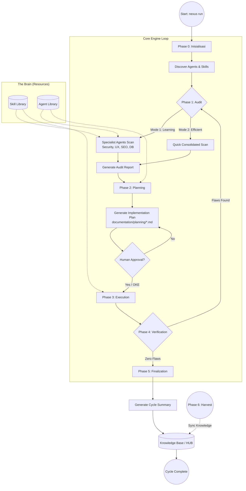

# 📊 Visualisasi Pipeline NEXUS AI

Dokumen ini berisi representasi visual dan penjelasan mendalam mengenai alur kerja **Nexus Engine** dalam mengelola kolaborasi Human-AI.

---

## 🗺️ Diagram Alur Pipeline

---

## 📝 Penjelasan Detail Tiap Fase

### 🛠️ Phase 0: Inisialisasi (`INIT`)
*   **Aksi**: Sistem memetakan folder proyek, mendeteksi keberadaan folder `nexus/`, dan menyiapkan lingkungan eksekusi.
*   **Intel**: Memeriksa `package.json` untuk memastikan seluruh dependensi engine tersedia.

### 🔍 Phase 1: Audit (Scanning & Intelligence)
*   **Tujuan**: Mengidentifikasi celah keamanan, bug, atau potensi optimasi.
*   **Mode Kerja**:
    *   **Learning**: Memberikan edukasi kepada developer melalui laporan spesialis (Cyber, UX, SEO).
    *   **Efficient**: Fokus pada resolusi cepat dengan laporan tunggal dari PM.
*   **Guardrails**: Engine dilarang memindai file sensitif tanpa persetujuan eksplisit dari User.

### 📅 Phase 2: Planning (Strategi & Kontrak)
*   **Tujuan**: Menyusun *Implementation Plan* sebagai kontrak kerja AI.
*   **Logika**: Mengubah setiap temuan audit menjadi tugas (tasks) yang terukur.
*   **Output**: File `.md` di folder `documentation/planning/` yang harus ditinjau manusia.

### 🚀 Phase 3: Execution (Pengerjaan)
*   **Tujuan**: AI melakukan modifikasi kode atau pembuatan fitur.
*   **Aturan**: AI hanya diperbolehkan menjalankan perintah yang sesuai dengan *Implementation Plan* yang telah disetujui.

### 🔍 Phase 4: Verification (Quality Control)
*   **Tujuan**: Validasi hasil kerja.
*   **Mekanisme**: Membandingkan status proyek terbaru dengan target yang ditetapkan di Phase 1 & 2.
*   **Zero Flaws**: Jika ditemukan ketidaksesuaian, sistem akan memaksa siklus kembali ke Phase 1.

### 📝 Phase 5: Finalization & Records
*   **Tujuan**: Pencatatan sejarah dan pembaruan pengetahuan.
*   **Output**: 
    *   `memory/short_term/`: Log lengkap setiap siklus.
    *   `memory/long_term/`: Ringkasan pelajaran teknis untuk referensi di masa depan (The HUB).
    *   **🧠 Universal Nexus Collision Logic (Opsi A maupun Opsi B)**:
        *   Logika ini adalah standar baku yang diterapkan di seluruh pipeline **HUB (Knowledge)** dan **SKILL**.
        *   **Kondisi**: Terjadi saat ada kemiripan antara "A" (yang sudah ada) dan "B" (yang baru masuk/direfactor), baik itu berupa teori di HUB maupun instruksi teknis di SKILL.
        *   **Implementasi di HUB & SKILL**:
          Opsi A: { Standard_Pattern_A } 
          Opsi B: { Alternative_Pattern_B }
          (Opsi Tak Terbatas untuk variasi solusi)
        *   **Alur Refactoring Universal**:
            1.  **HUB Refactor**: Menggabungkan variasi dokumentasi fitur di folder `memory/long_term/`.
            2.  **SKILL Refactor**: Jika di folder `skill/` ditemukan teknik koding baru yang mirip dengan yang lama, keduanya disimpan sebagai **Pilihan Opsi (A/B/dst)** sebagai pilihan strategi bagi agen.
        *   **Tujuan**: Menjamin bahwa sistem tidak hanya memiliki satu cara kerja, melainkan sebuah **"Decision Tree"** dengan opsi tak terbatas yang kaya bagi AI untuk memilih solusi paling optimal (Context-Aware).

### 🌾 Phase 6: Harvesting (Cross-Project Knowledge)
*   **Tujuan**: Sinkronisasi pengetahuan lintas proyek.
*   **Aksi**: Mengumpulkan dokumentasi "Emas" dari proyek lain ke dalam `golden/` hub pusat.

---
*Dokumen ini merupakan bagian dari standar operasional Human-AI Nexus.*
