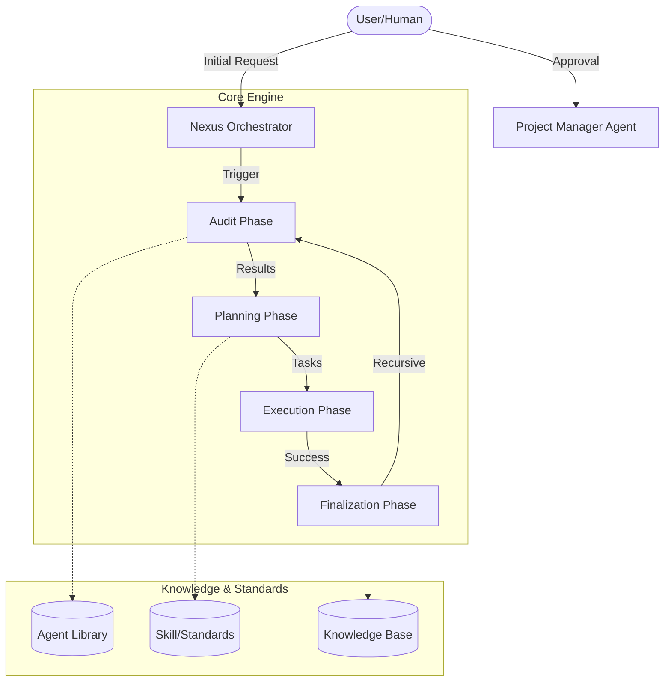

# System Architecture

The Human-AI Nexus is built as a modular orchestration system.

## Architecture Diagram

## Components

### 1. Nexus Orchestrator (`NexusEngine.js`)
The central brain that coordinates the flow between phases. It ensures that data from the Audit phase is correctly passed to Planning, and that Execution only happens after approval.

### 2. Agent Layer
A collection of markdown files in `agent/` that define the persona, responsibilities, and guardrails for different AI agents (e.g., Architect, Engineer, QA).

### 3. Skill Layer
Technical standards and "best practice" snippets in `skill/` that guide the agents during the Execution phase.

### 4. Persistence Layer
Folders for `audit`, `planning`, `records`, and `knowledge` that ensure every step of the process is documented and persisted for long-term project memory.

---

## Ecosystem Integration

Nexus AI is designed to be highly portable and integrable with existing codebases.

- **External Pipeline**: The system intelligently detects and manages project-specific documentation and local AI "brains" inside the project root.
- **Deep Recaps**: Detailed documentation on how the engine interacts with external environments:
    - [Internal Pipeline Recap](NEXUS_INTERNAL_PIPELINE_RECAP.md)
    - [External Pipeline Recap](NEXUS_EXTERNAL_PIPELINE_RECAP.md)

